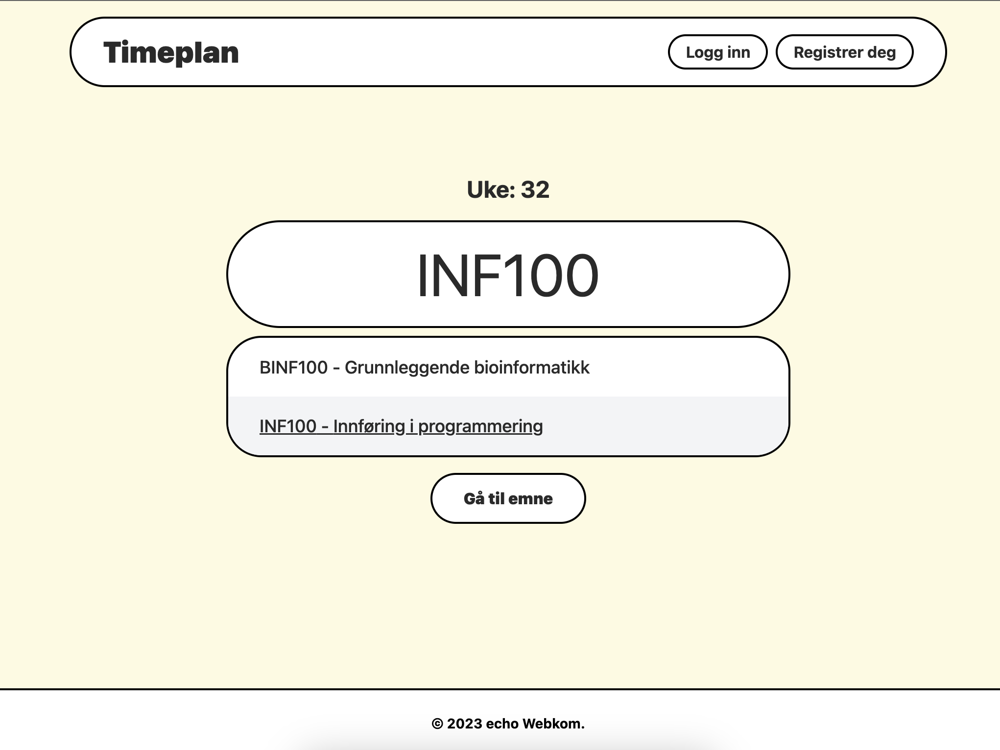

# UiB Timeplan

An a more modern and user friendly timetable for the University of Bergen. Alternative frontend for [TP](https://tp.educloud.no/uib/).

## Development

### Prerequisites

- [Node.js](https://nodejs.org/en/) (v18.x)
- [pnpm](https://pnpm.io/) (v6.x)
- [Docker](https://www.docker.com/) (v20.x)

### Setup

1. Clone the repository
2. Install dependencies: `pnpm install`
3. Start the database: `docker compose up -d`
4. Run site in development mode: `pnpm dev`

It should now be running on [localhost:3000](http://localhost:3000/).
